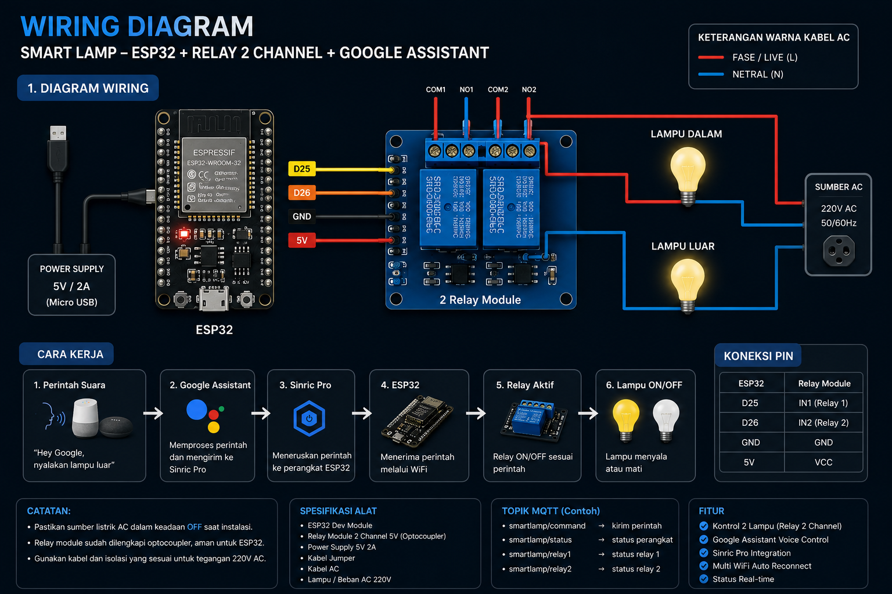

# Voice Control using ESP32 & Google Assistant

This project is an IoT-based smart lighting system that allows users to control two lamps remotely using **Google Assistant**. The system utilizes an **ESP32** connected to a **2-channel relay**, while **Sinric Pro** acts as the cloud platform to bridge communication between Google Assistant and the ESP32.

## Features

- Control 2 lamps remotely
- Voice command using Google Assistant
- Real-time communication via the Internet
- Multi-WiFi support
- Automatic WiFi reconnection
- ESP32-based hardware

## Communication Flow

```text
Google Assistant
        │
        ▼
    Sinric Pro
        │
        ▼
      ESP32
        │
        ▼
 Relay 2 Channel
        │
        ▼
     Smart Lamp
```

## Wiring Diagram



## Hardware

- ESP32 Dev Module
- 2-Channel Relay Module
- 2 LED Lamps
- Lamp Holders
- Jumper Wires
- 5V Power Supply

## Software

- Arduino IDE
- Sinric Pro
- Google Home
- Google Assistant
